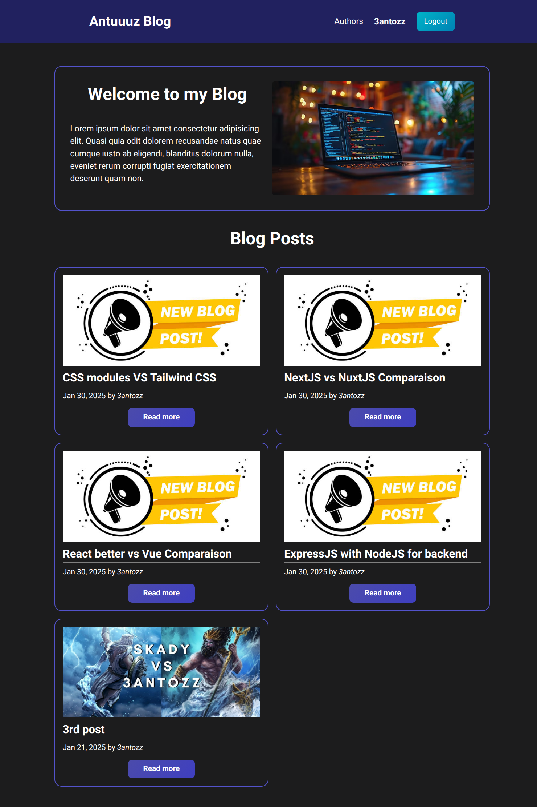
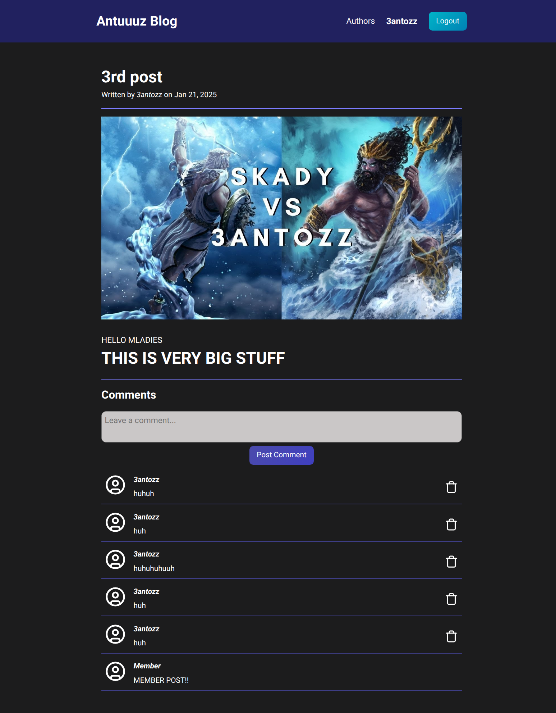
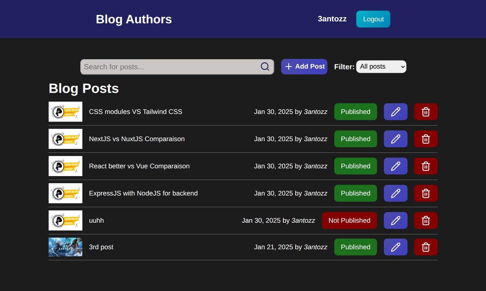
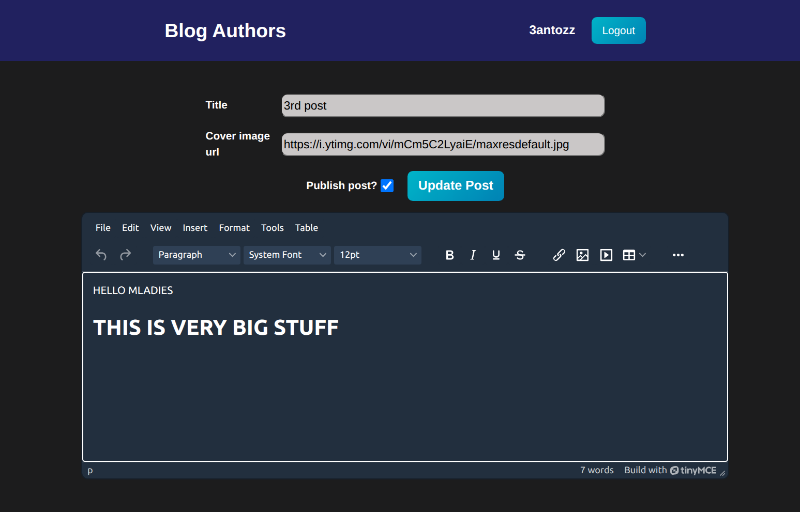

# Blog Page

Fullstack blog application with CMS for authors.

## Visitors Index



## Blog Page



## Authors Index



## Blog Creation



## Features

- Authentification via username & password (JWT).
- Interaction with blogs via comments.
- Separate Content Management System for authors.
- Rich text editor for authors.

## Why build this project ?

This is my first FullStack project, it's purpose was to tie everything I learned together in a fun project.
It's a Simple Blog app with a Backend API and 2 separate frontends:
- First frontend is for normal users, blog visitors.
- Second frontend is for authors, to create and edit posts and comments.
> [!NOTE]
> you need to be an admin to login on this, use the following account: **username: 3antozz, password: 123456**


## Technologies Used

### Frontend

- Javascript
- React
- Vite
- Vercel
- TinyMCE

### Backend

- Express
- Nodejs
- PostgreSQL
- Prisma ORM
- Socket.IO
- OnRender
- Neon

## 🛠️ How to Run the Project Locally

> [!IMPORTANT]
> This is a monorepo, so everything is in this Repo, both frontends are seperated inside /react folder.

### Prerequisites

- [Node.js](https://nodejs.org/)
- [npm](https://www.npmjs.com/)
- [PostgreSQL](https://www.postgresql.org/) (ensure your database is running)
- Basic knowledge of using a terminal (steps are beginner-friendly)

---

### 1. Clone the Repository

```bash
git clone https://github.com/3antozz/Blog-Page
cd Blog-Page
```

### 2. Setup the Backend (API)

```bash
cd api
npm install
```

**1- Create a .env file in the node/ directory (based on .env.example) and fill in the required environment variables such as:** 

* Database connection URL
* Session secret

2- Start the backend server:

```bash
npm start
```
> [!NOTE]
> The backend will run on http://localhost:3000 by default.

### 3. Setup the Frontend (Client)

> [!IMPORTANT]
> Each frontend is inside it's own folder in the /react directory, **/users_app** is for visitors; **authors_app** is for authors.

1- Open a new terminal window or tab:
```bash
cd react
cd users_app (cd authors_app)
npm install
npm run dev
```
**2- Rename the .env.example file to .env in the react/ directory**

> [!NOTE]
> The app is using TinyMCE rich text editor which requires a personal API key, it will be replaced with a normal textarea element if you don't have it or dont want to acquire it.

> [!NOTE]
> The frontend will run on http://localhost:5173 by default.

### 4. Open in Browser

1- Once both servers are running:

2- Visit http://localhost:5173 in your browser

## Libraries Used

### Frontend

- [React-router](https://www.npmjs.com/package/react-router-dom) – Client side routing.
- [Lucide React](https://lucide.dev/guide/packages/lucide-react) – Import Icons.
- [tinymce-react](https://www.npmjs.com/package/@tinymce/tinymce-react) – Rich text editor.
- [DOMPurify](https://www.npmjs.com/package/dompurify) – Sanitizer for generated HTML content by the text editor.
- [html-react-parser](https://www.npmjs.com/package/html-react-parser) – This parser converts an HTML string to one or more React elements.

### Backend

- [bcryptjs](https://www.npmjs.com/package/bcryptjs) – For securing passwords by hashing and salting.
- [jsonwebtoken](https://www.npmjs.com/package/jsonwebtoken) – Implementation of JSON Web Token for signing tokens and authenticating users.
- [passport](https://www.npmjs.com/package/passport) – Express-compatible authentication middleware for Node.js.
- [passport-jws](https://www.npmjs.com/package/@types/passport-jwt) –  Passport strategy for authenticating with a JSON Web Token.
- [date-fns](https://date-fns.org/docs/Getting-Started) – Used for manipulating JavaScript dates.
- [express-validator](https://www.npmjs.com/package/express-validator) – User input validation middleware.
- [express-async-handler](https://www.npmjs.com/package/express-async-handler) – Asynchronous exception-handling middleware.
- [cors](https://www.npmjs.com/package/cors) – Package for providing a Connect/Express middleware that can be used to enable CORS.
